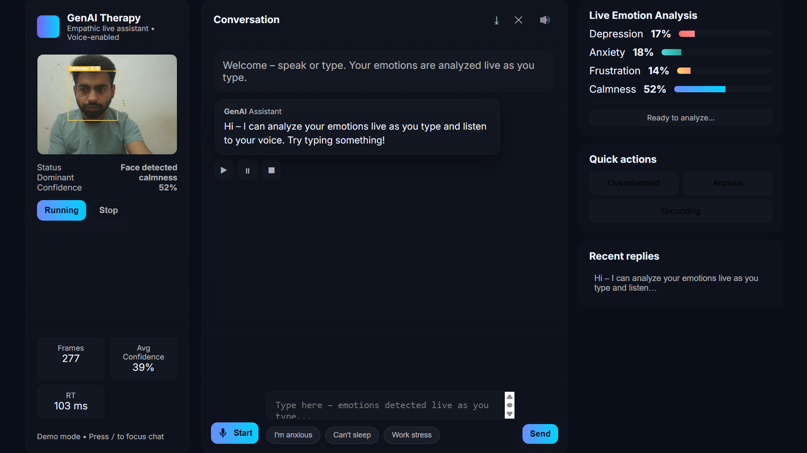
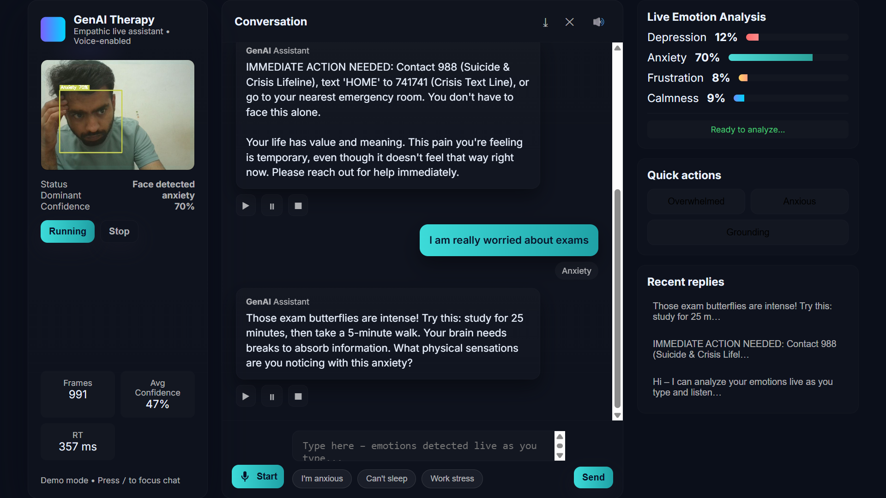
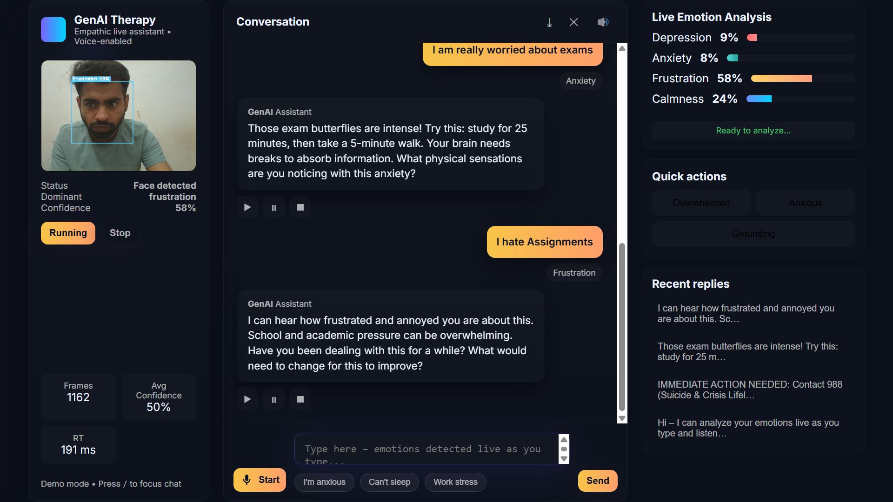
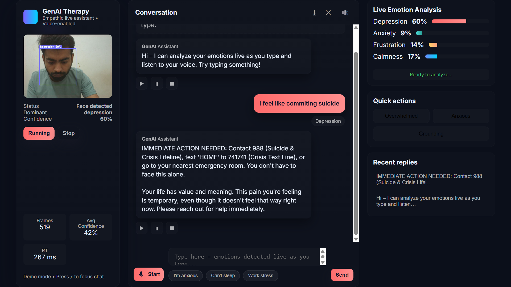
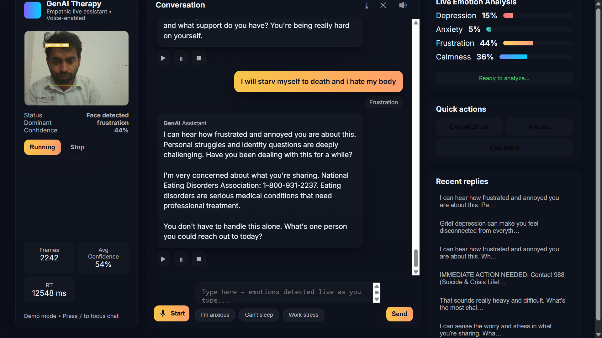
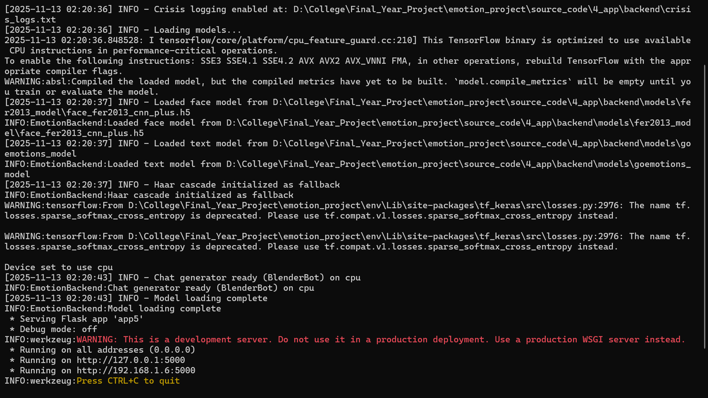

# GenAI Approach for Detection of Depression | AI & Data Science

An academic **AI-powered emotion detection system** built using **Machine Learning, NLP, Computer Vision, and Generative AI**, designed to identify **depression, anxiety, stress, and frustration** and generate **empathetic, context-aware responses**.

This project was developed as a **Final Year B.Tech (CSE) College Project**, with a strong focus on **mental wellness, ethical AI, and real-time emotion-aware interaction**.

---

## 🔗 Project Links

- 📄 **Thesis Document:**  
[Available in Repository]

- 💼 **LinkedIn Profile:**  
[LinkedIn](https://www.linkedin.com/in/harsh-bajaj-data-analyst/)

---

## 🧩 Problem Statement

Mental health challenges such as **depression, anxiety, and emotional distress** are becoming increasingly common among students and working professionals. However, access to immediate emotional support is often limited.

Most existing AI systems:
- Lack **emotional awareness**
- Provide **generic or robotic responses**
- Fail to detect **high-risk emotional situations**

The objective of this project is to design an **emotion-aware AI system** that can analyze user inputs, detect emotional states, and respond in a **supportive, ethical, and non-diagnostic manner**.

---

## 🎯 Project Objective

To design and implement a **multimodal AI system** capable of:

- Detecting emotional states such as **Depression, Anxiety, Stress, and Frustration**
- Analyzing **text-based emotional cues**
- Identifying **crisis situations** using rule-based logic
- Generating **empathetic responses** using Generative AI
- Supporting **early emotional awareness**, not medical diagnosis

---

## 🖥️ System Overview

The system follows a **multi-layered, multimodal architecture** designed to capture, analyze, and respond to human emotional states in real time:

- **Input Layer:**  
  Multi-modal data capture using **real-time webcam feed (facial expressions)** and **user text input**.

- **Emotion Detection Layer:**  
  - Computer Vision–based facial emotion recognition using a CNN model  
  - NLP-based emotion classification from textual input

- **Crisis Detection Layer:**  
  Rule-based logic combined with model confidence scores to identify **high-risk emotional states**.

- **Response Generation Layer:**  
  Generative AI–based **empathetic and context-aware response generation**.

- **Backend Layer:**  
  API-driven processing, inference orchestration, and logging.

---

## Dashboard Overview (Calm UI State)

  

---

## Real-Time Anxiety Analysis

  

---

## Academic Stress & Frustration Detection

  

---

## Crisis Intervention – Suicide Prevention

  

---

## Crisis Intervention – Eating Disorder Detection

  

---

## Backend Processing & Logs

  

---

## ⚙️ Technologies Used

- **Programming Language:**  
  Python

- **Computer Vision:**  
  OpenCV, TensorFlow  
  CNN-based facial emotion recognition trained on the **FER2013 dataset**

- **Natural Language Processing (NLP):**  
  Transformer-based text emotion analysis using the **GoEmotions dataset**

- **Generative AI:**  
  BlenderBot / LLM-based models for **empathetic and context-aware response generation**

- **Backend:**  
  Flask (Python), Werkzeug  
  REST-based API handling and inference orchestration

- **Frontend:**  
  JavaScript, HTML5, CSS3  
  Real-time visualization using **main.js**

- **Logic Layer:**  
  Rule-based crisis detection and severity classification

---

## 🧭 Key Features

- Emotion detection for:
  - Depression
  - Anxiety
  - Stress
  - Frustration
- Real-time emotional analysis
- Crisis keyword identification
- Ethical, non-diagnostic response handling
- Calm and minimal UI for sensitive use cases

---

## 📈 Learning Outcomes

- Understanding of **emotion-aware AI systems**
- Practical experience with **NLP and Generative AI**
- Exposure to **ethical AI design principles**
- Building real-time AI workflows with backend integration
- Designing systems for **human-centered AI applications**

---

## ⚠️ Disclaimer

This system is **not a medical or diagnostic tool**.

- It does not replace professional mental health support
- Responses are AI-generated and informational
- Users experiencing emotional distress should seek help from qualified professionals

---

## 👤 Ownership & Academic Details

- **Project Title:** GenAI Approach for Detection of Depression  
- **Student Name:** Harsh Bajaj
- **Guide Name:** Dr. Sneha Bohra  
- **Degree:** B.Tech – Computer Science & Engineering  
- **Institution:** G H Raisoni University, Amravati  
- **Academic Year:** 2025–26  
- **Project Type:** Final Year Academic Project  

All analysis, system design, implementation, and documentation were created solely for **academic and learning purposes**.

---
